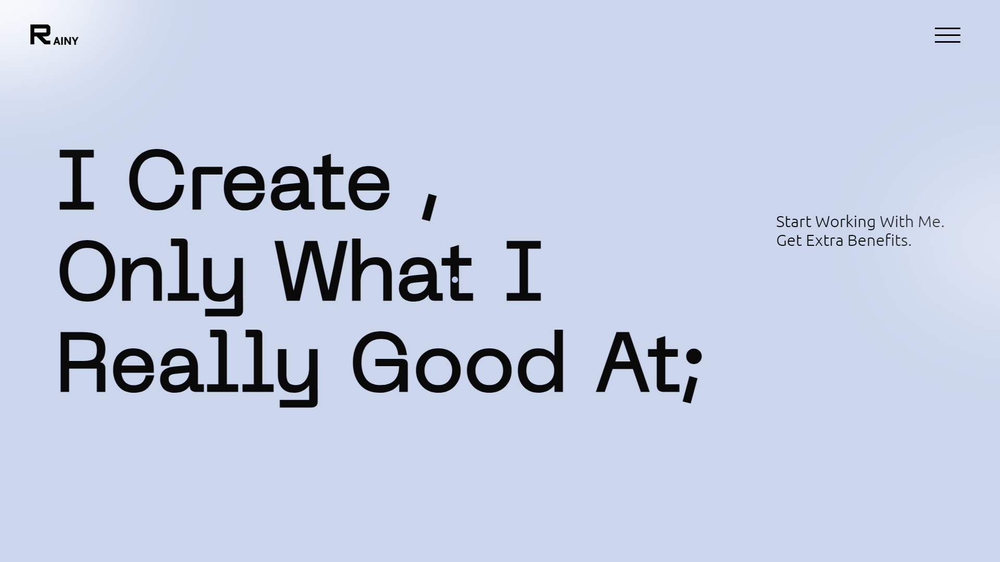

<!--  -->

# Hello World!, I'm Manish, a FullStack Web Developer 👋🏼:
🛜 currently Looking for some opportunity 👨🏼‍🎓 Learning by My-Self 👨🏼‍💻 working as a web developer since March 2023

# 💻 Tech Stack:
              

# 🎨 Creative Stack:
     )

<picture>
  <source media="(prefers-color-scheme: dark)" srcset="https://raw.githubusercontent.com/tobiasmeyhoefer/tobiasmeyhoefer/output/github-snake-dark.svg" />
  <source media="(prefers-color-scheme: light)" srcset="https://raw.githubusercontent.com/tobiasmeyhoefer/tobiasmeyhoefer/output/github-snake.svg" />
  
</picture>